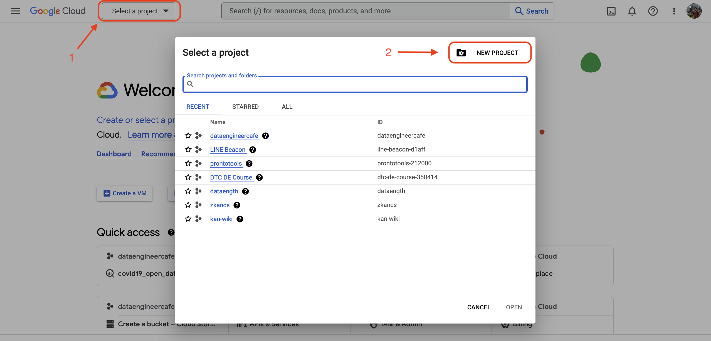
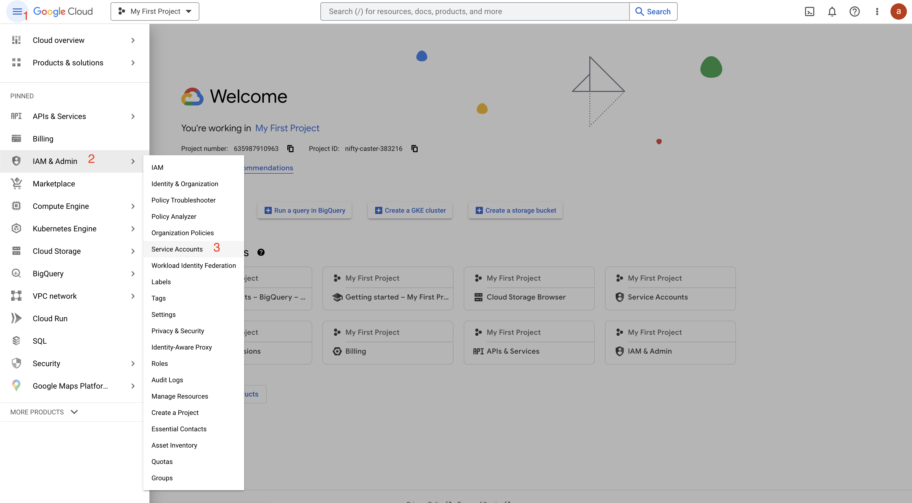
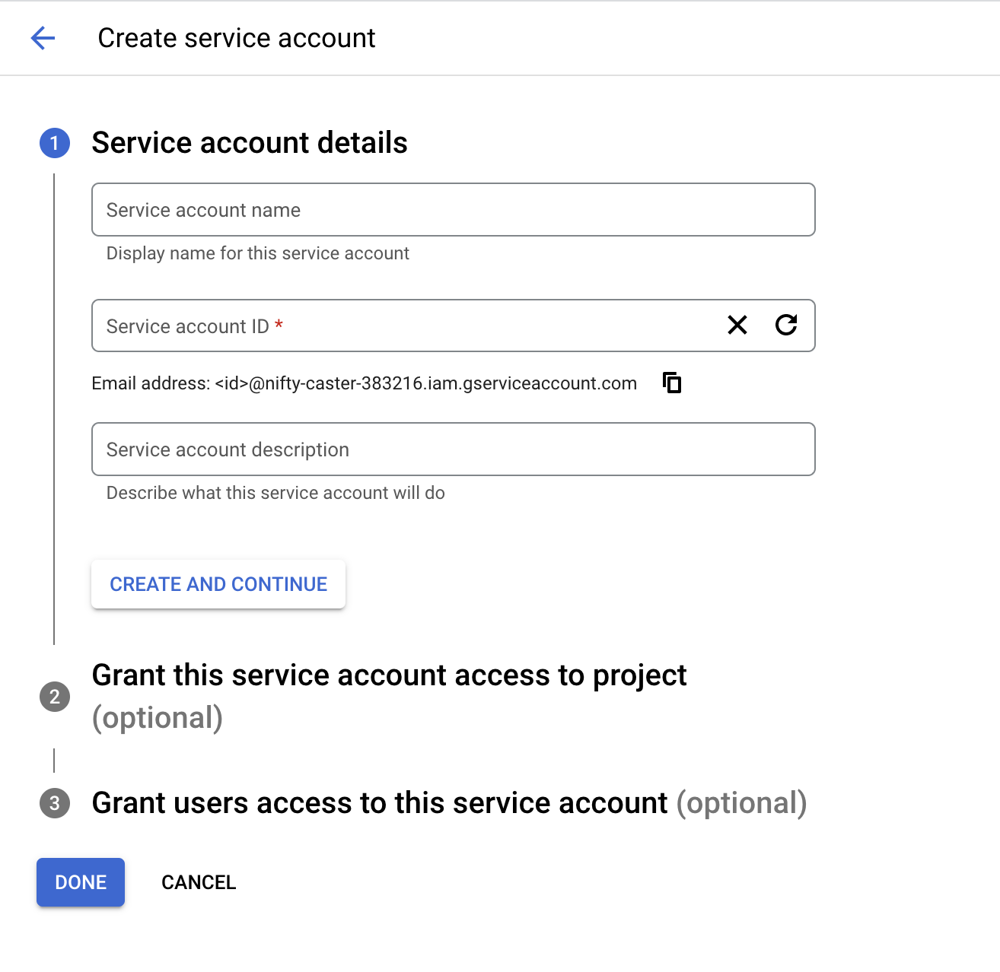
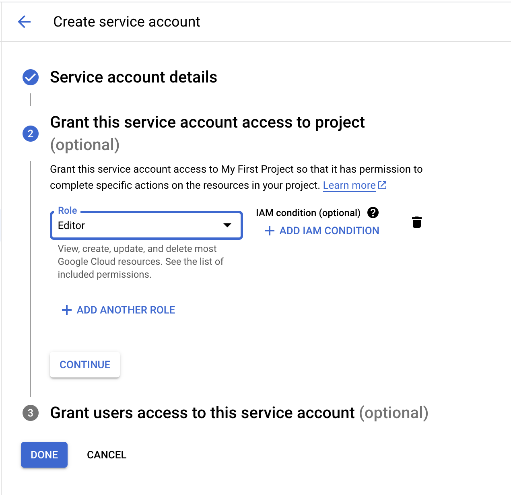
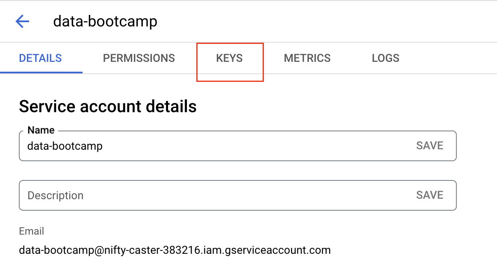
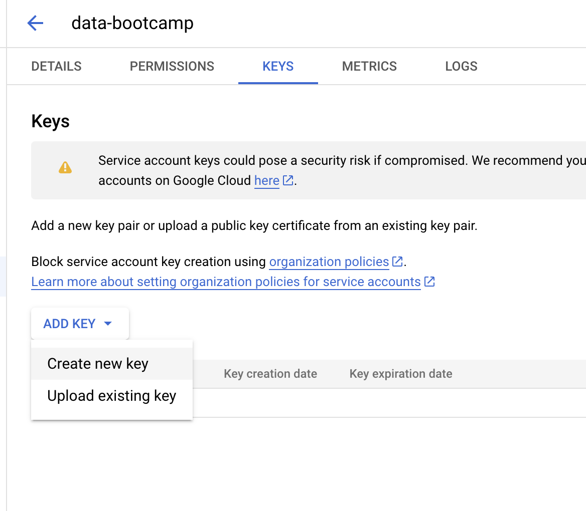
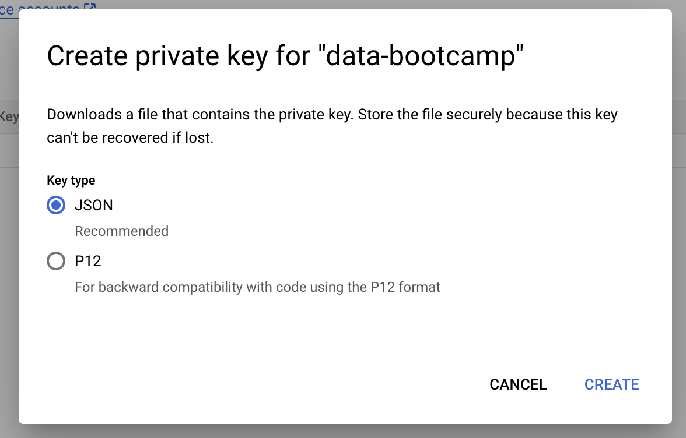

# Guidelines

### Table of Contents

#### About Programming

* [Python Basics](#python-basics)
* [Common Unix Commands](#common-unix-commands)
* [Git & GitHub Basics](#git--github-basics)
* [Docker Basics](#docker-basics)

#### About Google Cloud Platform (GCP)

* [How to Register For Google Cloud Platform (GCP) Account](#how-to-register-for-google-cloud-platform-gcp-account)
* [How to Create a GCP Project](#how-to-create-a-gcp-project)
* [How to Create Service Account](#how-to-create-service-account)
* [How to Use Google BigQuery](#how-to-use-google-bigquery)
* [How to Use Google Cloud Storage (GCS)](#how-to-use-google-cloud-storage-gcs)

## Python Basics

### Setting Up a Python Virtual Environment 

#### Using venv

ก่อนที่เราจะเริ่มโปรเจค Python ใด ๆ ก็ตาม เราควรที่จะมี environment ที่เหมาะสม เพื่อเอาไว้จัดการพวก libraries หรือ packages ต่าง ๆ ก่อน และ environment ที่พูดถึงนี้ในภาษา Python เราจะเรียกว่า "Python virtual environment"

ดังนั้นในขั้นตอนนี้เราจะสร้าง Python virtual environment กันก่อน โดยใช้คำสั่ง

```bash
python -m venv ENV
```

คำสั่งด้านบน แปลความได้ว่า เราจะใช้ Python module ที่ชื่อ `venv` สร้าง Python virtual environment ที่ชื่อว่า `ENV` ขึ้นมา โดยผลลัพธ์ที่ได้จากขั้นตอนนี้ เราจะเห็นว่ามีโฟลเดอร์ `ENV` เกิดขึ้น และข้างในโฟลเดอร์นี้จะมีของต่าง ๆ เกี่ยวกับ Python ซึ่งในโฟลเดอร์พวกนี้แหละ จะเป็นที่เก็บ libraries หรือ packages ที่เราติดตั้ง

หลังจากที่เรามี Python virtual environment แล้ว เราจะต้อง activate ก่อน ถึงจะสามารถใช้งานได้ เราจะใช้คำสั่ง

```bash
source ENV/bin/activate
```

ถ้าเป็นเครื่อง Windows เราจะใช้คำสั่ง

```bash
ENV\Scripts\activate
```

สังเกตผลลัพธ์ที่ได้ทางซ้ายมือของ shell หรือ command line ของเราจะมีวงเล็บ `(ENV)` เป็นชื่อ environment หรือชื่อ folder ที่เราสร้างขึ้น

##### Installing Python Packages

หลังจากที่เราอยู่ใน virtual environment นั้นแล้ว เราสามารถที่จะติดตั้ง Python package ต่าง ๆ เพิ่มเติมได้ โดยใช้คำสั่ง

```bash
pip install <python_package_name>
```

หรือถ้ามีรายการ package ที่ต้องติดตั้งเก็บอยู่ที่ไฟล์ `requirements.txt` เราก็สามารถสั่งคำสั่งด้านล่างนี้ได้เลย จะเป็นการติดตั้ง package ทั้งหมด

```bash
pip install -r requirements.txt
```

#### Using Poetry

นอกจาก `venv` แล้ว เรายังสามารถใช้ [Poetry](https://python-poetry.org/) ในการจัดการ Python package dependencies ได้เช่นกัน

##### Installing Python Packages

เราสามารถใช้คำสั่งด้านล่างนี้ในการติดตั้ง package

```bash
poetry add <python_package_name>
```

ในการใช้ Poetry เราจะมีไฟล์ `pyproject.toml` อยู่ ซึ่งในไฟล์นี้จะเก็บรายการ package ต่าง ๆ ที่เราติดตั้งไว้ ถ้าเรามีไฟล์นี้อยู่แล้ว เราสามารถสั่งคำสั่งด้านล่างนี้ได้เลย เพื่อติดตั้ง package ทั้งหมด

```bash
poetry install
```

## Common Unix Commands

| Description | Command | Example |
| - | - | - |
| List contents | ls | `$ ls -l` |
| Make directory | mkdir &lt;dirname&gt; | `$ mkdir environment` |
| Change directory | cd &lt;dirname&gt; | `$ cd environment/` |
| Change one directory up | | `$ cd ..` |
| Change to home directory | | `$ cd ~ or just $ cd` |
| Change to path including home directory | | `$ cd ~/environment/` |
| Move file (rename) | mv &lt;source&gt; &lt;target&gt; | `$ mv foo bar` |
| Copy file | cp &lt;source&gt; &lt;target&gt; | `$ cp foo bar` |
| Remove file | rm &lt;file&gt; | `$ rm foo` |
| Remove empty directory | rmdir &lt;directory&gt; | `$ rmdir environment/` |
| Remove nonempty directory | rm -rf &lt;directory&gt; | `$ rm -rf tmp/` |
| Concatenate & display file contents | cat &lt;file&gt; | `$ cat ~/.ssh/id_rsa.pub` |

### References

- [What is Command Line Interface (CLI)?](https://www.w3schools.com/whatis/whatis_cli.asp)
- [Command Line Commands – CLI Tutorial](https://www.freecodecamp.org/news/command-line-commands-cli-tutorial/)
- [Learn the Command Line](https://www.codecademy.com/learn/learn-the-command-line)

## Git & GitHub Basics

| Description | Command | Example |
| - | - | - |
| Create an empty Git repository or reinitialize an existing one | init | `$ git init` |
| Clone a repository into a new director | clone | `$ git clone` |
| Show the working tree status | status | `$ git status` |
| Show changes between commits, commit and working tree, etc. | diff | `$ git diff` |
| Add file contents to the index | add &lt;pathspec&gt; | `$ git add` |
| Record changes to the repository | commit | `$ git commit` |
| Fetch from and integrate with another repository or a local branch | pull | `$ git pull` |
| Update remote refs along with associated objects | push | `$ git push` |

### References

- [Git Tutorial](https://www.w3schools.com/git/)
- [Introduction to Git](https://www.datacamp.com/courses/introduction-to-git)
- [An open source game about learning Git!](https://ohmygit.org/)
- [Learn Git Branching](https://learngitbranching.js.org/)
- [Learn Git & GitHub](https://www.codecademy.com/learn/learn-git)
- [GitHub Skills](https://skills.github.com/)
- [Getting started with GitHub documentation](https://docs.github.com/en/get-started)

## Docker Basics

### Docker Desktop

ในกรณีที่ใช้เครื่องตัวเอง สามารถใช้โปรแกรม Docker เพื่อรัน applications ขึ้นมาได้ โดยไม่ต้องสนใจเรื่องของการเซตอัพ infrastructure หรือ package ต่าง ๆ

- Mac - [https://docs.docker.com/desktop/install/mac-install/](https://docs.docker.com/desktop/install/mac-install/)
- Linux - [https://docs.docker.com/desktop/install/linux-install/](https://docs.docker.com/desktop/install/linux-install/)
- Windows - [https://docs.docker.com/desktop/install/windows-install/](https://docs.docker.com/desktop/install/windows-install/)

### References

- [A Docker Tutorial for Beginners](https://docker-curriculum.com/)

## How to Register For Google Cloud Platform (GCP) Account

1. ถ้ายังไม่เคยมี Gmail account ให้สมัครได้ที่ [Create your Gmail account](https://www.google.com/gmail/about/) ซึ่งการจะใช้งาน Google Cloud Platform (GCP) ได้ จะต้องมี Gmail account ก่อน
1. เข้าเว็บไซต์ https://cloud.google.com/

    

1. คลิกปุ่ม **Get started for free**
1. Sign in ด้วย Gmail

    

1. กรอกข้อมูลสำหรับใช้งาน GCP

    ### Step 1/2

    1. เลือก Country : Thailand
    1. เลือก What the best descripes you organization or need : Other
    1. เลือก Term of Service
    1. คลิกปุ่ม CONTINUE

    <br/>

    

    ### Step 2/2

    1. เลือก Account type เป็น **individual**
    1. กรอกข้อมูล Payment method
    1. คลิกปุ่ม CONTINUE

    <br/>

    

1. เมื่อสมัครเสร็จเรียบร้อย ระบบจะพามาที่หน้า GCP Console

    

# How to Create a GCP Project

ในการเริ่มต้นการใช้งาน service ใด ๆ ก็ตาม เราต้องสร้าง project ก่อน (ถ้ายังไม่ได้สร้าง) โดยให้กดที่ drop-down ด้านบนข้าง ๆ คำว่า Google Cloud (เลข 1) เสร็จแล้วจะมี pop-up ขึ้นมา หลังจากนั้นให้กดปุ่ม NEW PROJECT (เลข 2) ตามรูป



หลังจากนั้นให้เราตั้งชื่อ project ของเราตามที่ต้องการ และเลือก Billing account ของเราเอง ส่วนตรง Location สามารถใช้ค่าตั้งต้นที่เป็น No organization ได้


เสร็จแล้วกดปุ่ม CREATE ก็เป็นอันเสร็จเรียบร้อย

# How to Create Service Account

ในการใช้งาน resources ต่างๆ ของ google clound ผ่าน api เราต้องสร้าง credential ในการทำ authentication 

วิธีในการสร้างให้เข้าไปที่เมนู IAM & Admin (เลข 2) > Service Accounts (เลข 3)



หลังจากนั้นกดเมนู **CREATE SERVICE ACCOUNT** ตามรูป


ตั้งชื่อให้กับ service account แล้วกด **CREATE AND CONTINUE**



กำหนก Role ให้กับ service account 



เสร็จแล้วกดปุ่ม DONE จะได้ service account 

ต่อไปเป็นการสร้าง credential ให้กับ service account ที่สร้างมา กดตรงชื่อของ servive account 


กดปุ่ม **KEYS** ตามรูป



กดปุ่ม ADD KEY > Create new key



เลือก key type เป็น json กด ปุ่ม CREATE



browser จะโหลด credentail อัตโนมัติก็จะเสร็จเรียบร้อย

## How to Use Google BigQuery

หลังจากที่เรา[สร้าง project](#how-to-create-a-gcp-project)แล้ว เราจะเริ่มใช้งาน BigQuery โดยค้นหาคำว่า BigQuery จาก search bar ตามรูปด้านล่างนี้ได้ หรือเลือกจาก menu ทางซ้ายมือก็ได้เช่นเดียวกัน


เราจะเข้ามาอยู่ที่หน้า home page ของ BigQuery


ตรงส่วน Explorer ทางซ้ายมือตามรูปด้านล่าง เราสามารถกดเลือกดูรายการ BigQuery dataset ต่าง ๆ หรือ table ได้ ถ้าตรงนี้เป็นการเริ่มใช้งาน BigQuery เป็นครั้งแรก จะยังไม่เห็น dataset หรือ table ใด ๆ ซึ่งเราสามารถกดสร้างเพิ่มเองได้ (กดที่ icon 3 จุดข้าง ๆ ชื่อ GCP Project จะเห็นตัวเลือกให้สร้าง dataset)


จากรูปทางขวามือจะเป็นการแสดงรายละเอียดของข้อมูลที่ชื่อ titanic หลังจากที่กดที่ table ที่ชื่อว่า "titanic" แล้ว

และถ้าเรากดปุ่ม + ที่อยู่ทางด้านบนข้าง ๆ tab ที่ชื่อ titanic จะเป็นการเปิด tab ใหม่ที่เราสามารถเขียน SQL เพื่อดึงข้อมูลได้ตามรูปด้านล่างนี้


หลังจากนี้เราก็สามารถนำ BigQuery ไปใช้งานวิเคราะห์ข้อมูลต่อได้แล้ว

## How to Use Google Cloud Storage (GCS)

หลังจากที่เรา[สร้าง project](#how-to-create-a-gcp-project)แล้ว เราจะเริ่มใช้งาน Google Cloud Storage (GCS) โดยค้นหาคำว่า Cloud Storage จาก search bar ตามรูปด้านล่างนี้ได้ หรือเลือกจาก menu ทางซ้ายมือก็ได้เช่นเดียวกัน


เราก็จะเข้ามาที่หน้า GCS console ตามรูปด้านล่างนี้


ที่ปุ่ม CREATE ทางด้านบน จะมีไว้สำหรับการสร้าง bucket หรือเรียกง่าย ๆ ว่าเป็นที่เก็บไฟล์ของเรา (นึกภาพเหมือนเราสร้างโฟลเดอร์ภายในเครื่องของเรา)

หลังจากที่กดปุ่ม CREATE แล้ว จะมีให้เรากรอกข้อมูลต่าง ๆ เช่น ชื่อ bucket


โดยเราอาจจะใส่ข้อมูลตามนี้ เพื่อความง่าย (ถ้าใช้งานระดับ production อาจจะต้องคำนึงถึงการใส่ข้อมูลเพิ่มเติม   )

* **Name:** `example-9124313 ` (ตรงนี้จะต้องเป็นชื่อที่ unique สำหรับแต่ละคน)
* **Location:** Region `asia-southeast-1 (Singapore)`
* **Storage class:** Standard
* **Access control:** Uniform
* **Protection tools:** None

เสร็จแล้วกดปุ่ม CREATE แล้วจะมี pop-up "Public access will be prevented" ขึ้นมา ให้เรากด CONFIRM แล้วเราก็ได้ bucket ของเรามาเรียบร้อยแล้ว และก็สามารถที่จะอัพโหลดไฟล์ขึ้นไปเก็บได้ตามที่เราต้องการ

