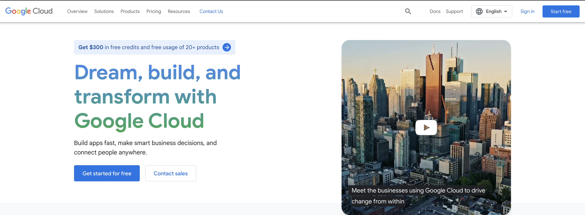
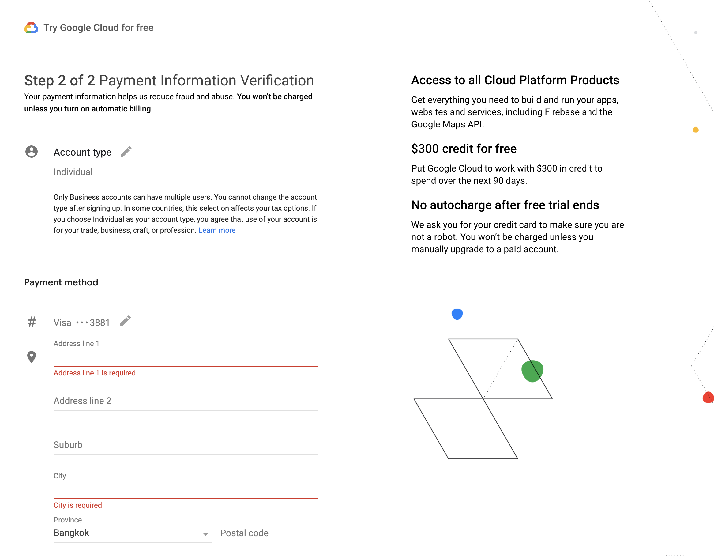
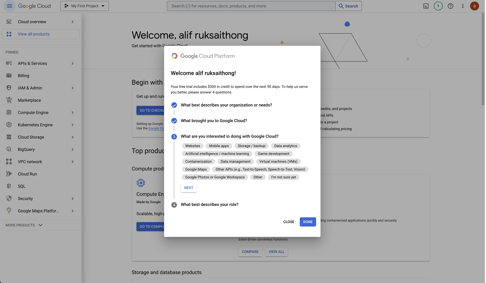
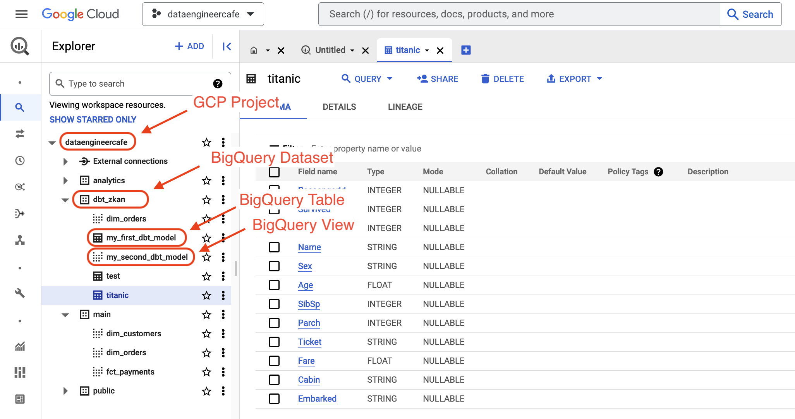

# Guidelines

### Table of Contents

* [How to Register For Google Cloud Platform (GCP) Account](#how-to-register-for-google-cloud-platform-gcp-account)
* [How to Create a GCP Project](#how-to-create-a-gcp-project)
* [How to Use Google BigQuery](#how-to-use-google-bigquery)
* [How to Use Google Cloud Storage (GCS)](#how-to-use-google-cloud-storage-gcs)

## How to Register For Google Cloud Platform (GCP) Account

1. ถ้ายังไม่เคยมี Gmail account ให้สมัครได้ที่ [Create your Gmail account](https://www.google.com/gmail/about/) ซึ่งการจะใช้งาน Google Cloud Platform (GCP) ได้ จะต้องมี Gmail account ก่อน
1. เข้าเว็บไซต์ https://cloud.google.com/

    

1. คลิกปุ่ม **Get started for free**
1. Sign in ด้วย Gmail

    

1. กรอกข้อมูลสำหรับใช้งาน GCP

    ### Step 1/2

    1. เลือก Country : Thailand
    1. เลือก What the best descripes you organization or need : Other
    1. เลือก Term of Service
    1. คลิกปุ่ม CONTINUE

     

    

    ### Step 2/2

    1. เลือก Account type เป็น **individual**
    1. กรอกข้อมูล Payment method
    1. คลิกปุ่ม CONTINUE

     

    

1. เมื่อสมัครเสร็จเรียบร้อย ระบบจะพามาที่หน้า GCP Console

    

# How to Create a GCP Project

ในการเริ่มต้นการใช้งาน service ใด ๆ ก็ตาม เราต้องสร้าง project ก่อน (ถ้ายังไม่ได้สร้าง) โดยให้กดที่ drop-down ด้านบนข้าง ๆ คำว่า Google Cloud (เลข 1) เสร็จแล้วจะมี pop-up ขึ้นมา หลังจากนั้นให้กดปุ่ม NEW PROJECT (เลข 2) ตามรูป

หลังจากนั้นให้เราตั้งชื่อ project ของเราตามที่ต้องการ และเลือก Billing account ของเราเอง ส่วนตรง Location สามารถใช้ค่าตั้งต้นที่เป็น No organization ได้

เสร็จแล้วกดปุ่ม CREATE ก็เป็นอันเสร็จเรียบร้อย

## How to Use Google BigQuery

หลังจากที่เรา[สร้าง project](#how-to-create-a-gcp-project)แล้ว เราจะเริ่มใช้งาน BigQuery โดยค้นหาคำว่า BigQuery จาก search bar ตามรูปด้านล่างนี้ได้ หรือเลือกจาก menu ทางซ้ายมือก็ได้เช่นเดียวกัน

เราจะเข้ามาอยู่ที่หน้า home page ของ BigQuery

ตรงส่วน Explorer ทางซ้ายมือตามรูปด้านล่าง เราสามารถกดเลือกดูรายการ BigQuery dataset ต่าง ๆ หรือ table ได้ ถ้าตรงนี้เป็นการเริ่มใช้งาน BigQuery เป็นครั้งแรก จะยังไม่เห็น dataset หรือ table ใด ๆ ซึ่งเราสามารถกดสร้างเพิ่มเองได้ (กดที่ icon 3 จุดข้าง ๆ ชื่อ GCP Project จะเห็นตัวเลือกให้สร้าง dataset)

จากรูปทางขวามือจะเป็นการแสดงรายละเอียดของข้อมูลที่ชื่อ titanic หลังจากที่กดที่ table ที่ชื่อว่า "titanic" แล้ว

และถ้าเรากดปุ่ม + ที่อยู่ทางด้านบนข้าง ๆ tab ที่ชื่อ titanic จะเป็นการเปิด tab ใหม่ที่เราสามารถเขียน SQL เพื่อดึงข้อมูลได้ตามรูปด้านล่างนี้

หลังจากนี้เราก็สามารถนำ BigQuery ไปใช้งานวิเคราะห์ข้อมูลต่อได้แล้ว

## How to Use Google Cloud Storage (GCS)

หลังจากที่เรา[สร้าง project](#how-to-create-a-gcp-project)แล้ว เราจะเริ่มใช้งาน Google Cloud Storage (GCS) โดยค้นหาคำว่า Cloud Storage จาก search bar ตามรูปด้านล่างนี้ได้ หรือเลือกจาก menu ทางซ้ายมือก็ได้เช่นเดียวกัน

เราก็จะเข้ามาที่หน้า GCS console ตามรูปด้านล่างนี้

ที่ปุ่ม CREATE ทางด้านบน จะมีไว้สำหรับการสร้าง bucket หรือเรียกง่าย ๆ ว่าเป็นที่เก็บไฟล์ของเรา (นึกภาพเหมือนเราสร้างโฟลเดอร์ภายในเครื่องของเรา)

หลังจากที่กดปุ่ม CREATE แล้ว จะมีให้เรากรอกข้อมูลต่าง ๆ เช่น ชื่อ bucket

โดยเราอาจจะใส่ข้อมูลตามนี้ เพื่อความง่าย (ถ้าใช้งานระดับ production อาจจะต้องคำนึงถึงการใส่ข้อมูลเพิ่มเติม   )

* **Name:** `example-9124313 ` (ตรงนี้จะต้องเป็นชื่อที่ unique สำหรับแต่ละคน)
* **Location:** Region `asia-southeast-1 (Singapore)`
* **Storage class:** Standard
* **Access control:** Uniform
* **Protection tools:** None

เสร็จแล้วกดปุ่ม CREATE แล้วจะมี pop-up "Public access will be prevented" ขึ้นมา ให้เรากด CONFIRM แล้วเราก็ได้ bucket ของเรามาเรียบร้อยแล้ว และก็สามารถที่จะอัพโหลดไฟล์ขึ้นไปเก็บได้ตามที่เราต้องการ

